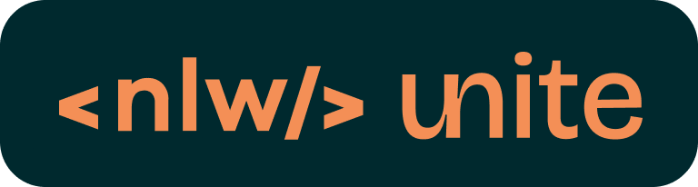
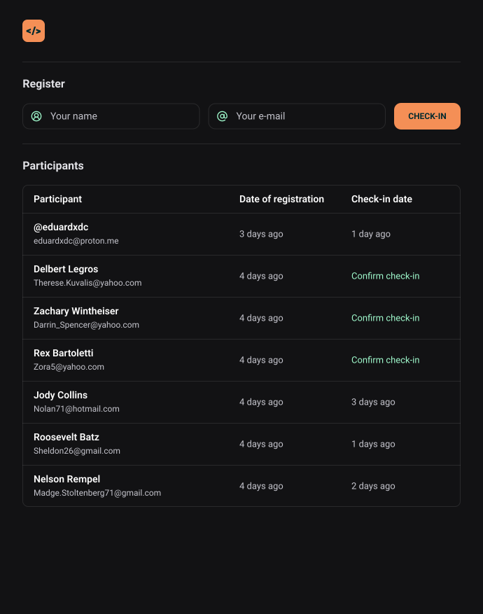

  

Application developed in RocketSeat NLW Unite in the HTML+CSS+JS track.

  <a href='#technologies'>Technologies</a>&nbsp;&nbsp;&nbsp;|&nbsp;&nbsp;&nbsp;
  <a href='#project'>Project</a>&nbsp;&nbsp;&nbsp;|&nbsp;&nbsp;&nbsp;
  <a href='LICENSE'>License</a>

  

 

  

## Technologies

The project was developed with the following technologies:

- HTML
- CSS
- JavaScript

## Project

In this project we will develop the simplified version of a check-in system for face-to-face events.
